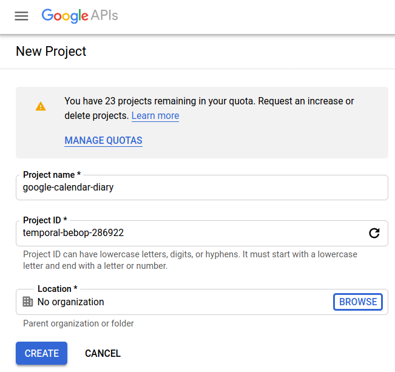
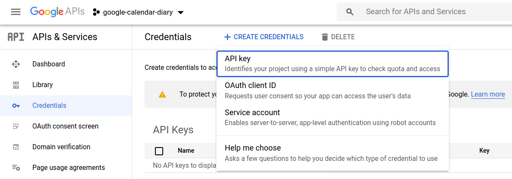
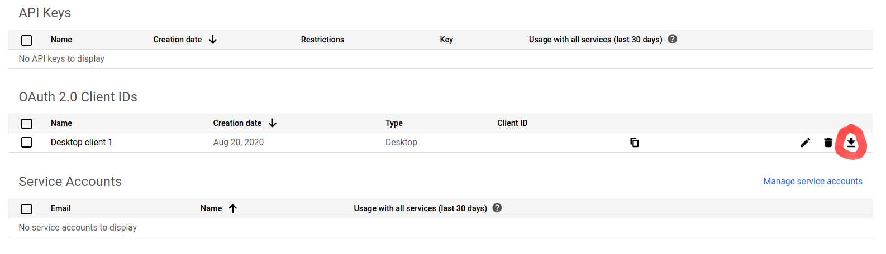
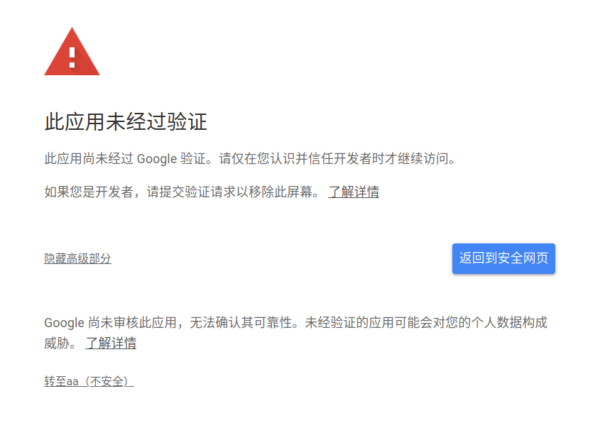

# Make Google Calendar as Your Diary
[](https://github.com/owen8877/calendar-as-diary)


## About

Want to automatically record part of your life business to a private calendar so as to avoid writing it down manually? If so, this project is just the right one you have been looking for!

Since we have already left quite a lot of footprints in various services over the internet, this project utilizes and processes these online information to generate a diary of your own. For the time being, Google Calendar is chosen as the calendar platform, but other calendar providers are also applicable (if we have time to work on that!).

Current services in support:
- Bilibili
- League of Legends
- Netflix
- Wakatime (for coding in supported IDEs)
- Youtube


## Guide

0. Make sure you have rust toolchain.
1. Edit `config/*.json` files from `config/*.json.default` templates.
2. `cargo build`
3. `RUST_LOG=info screen cargo run`


## Technical Issues
### How to Create a Token for Google Calendar API
1. First, get yourself a Google account. After that, create a new project at [Google API Console](//console.developers.google.com/projectcreate) (notice that the user interface may vary)


2. Use the "Go to APIs overview" link in the dashboard and click on "Enable API and services" button. Search for "Google Calendar API" in the various choices of APIs.

3. In this step we are going to fill in some info about consent page (which really doesn't need to exist). On the [OAuth consent screen](//console.developers.google.com/apis/credentials/consent) page, select:
    <ul>
        <li>Type: External</li>
        <li>Application name: any name you like</li> 
        <li>Add scope: '../auth/calendar' and '../auth/calendar.events' (to enable writes to the calendar)</li>
    </ul>Great! A test-run OAuth consent screen has been set up. (In fact you don't have to have it verified)

4. Get back to the [Credentials](//console.developers.google.com/apis/credentials) page. Create a credential by choosing "OAuth Client ID" and further select "Application Type" as  "Desktop". (Note: not the highlighted option but the one below it)


5. Download credentials and paste it into `clientsecret.json`. It should look something like
    ```json
    {
      "installed": {
        "client_id": "xxx.apps.googleusercontent.com",
        "project_id": "xxx",
        "auth_uri": "https://accounts.google.com/o/oauth2/auth",
        "token_uri": "https://oauth2.googleapis.com/token",
        "auth_provider_x509_cert_url": "https://www.googleapis.com/oauth2/v1/certs",
        "client_secret": "xxx",
        "redirect_uris": [
          "urn:ietf:wg:oauth:2.0:oob",
          "http://localhost"
        ]
      }
    }
    ```
    

6. When the binary is at the first run, you should expect to see the following:
    ```
    Please direct your browser to https://accounts.google.com/o/oauth2/auth?..., follow the instructions and enter the code displayed here:
   ```
   Open the link, ignore the warning and proceed to grant access permissions. After that paste the code back to the console and your calendar will get updated!
